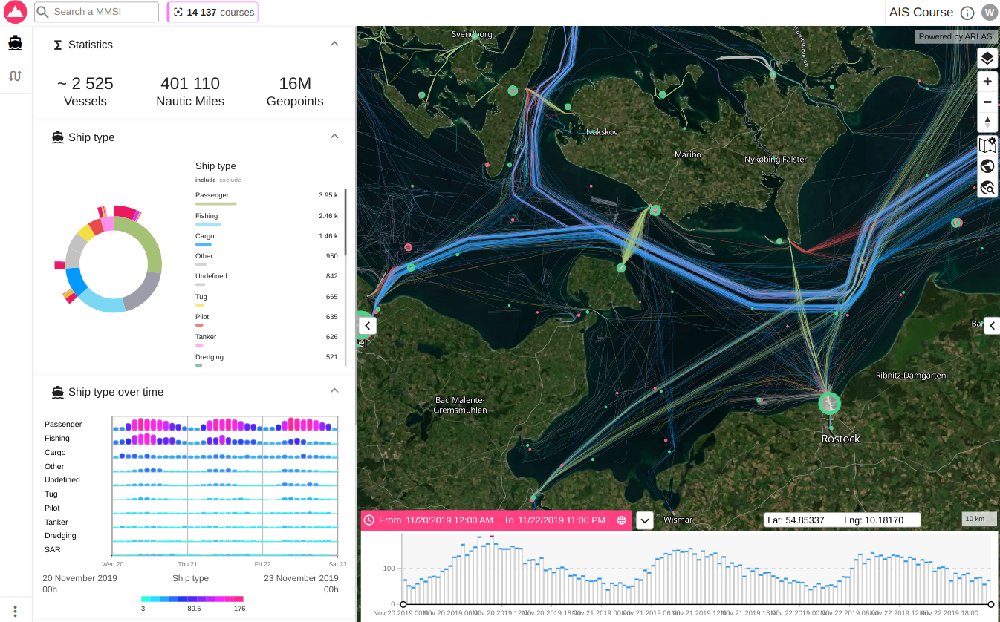
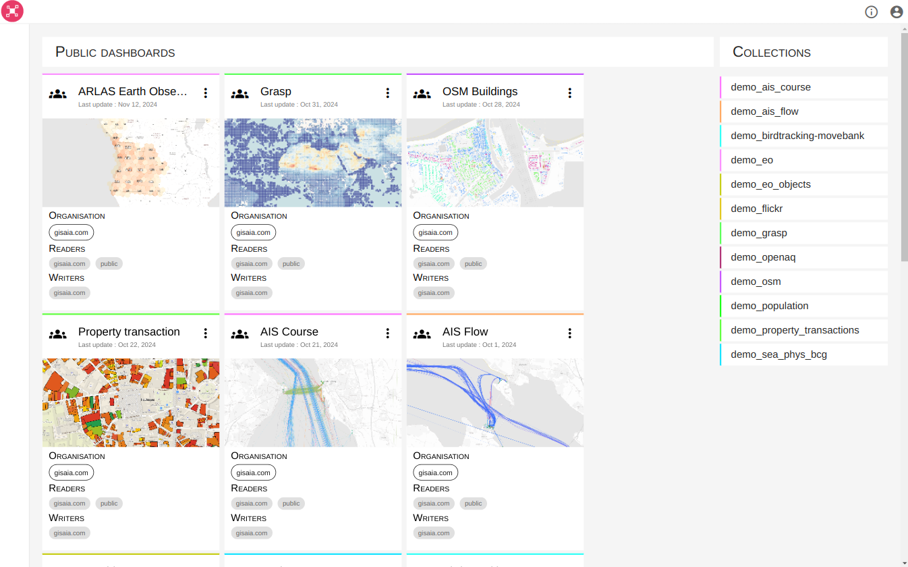
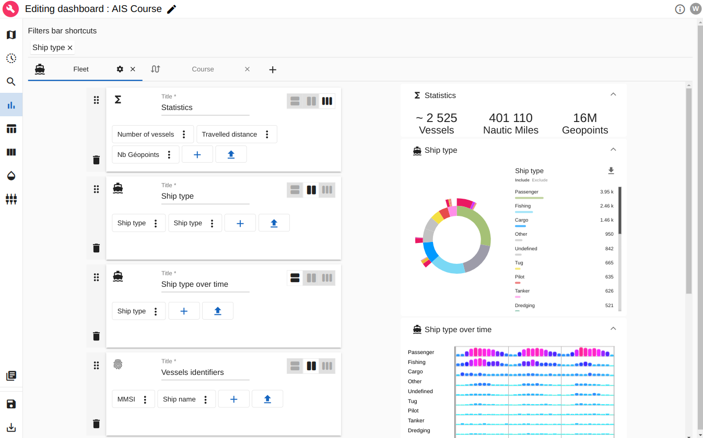
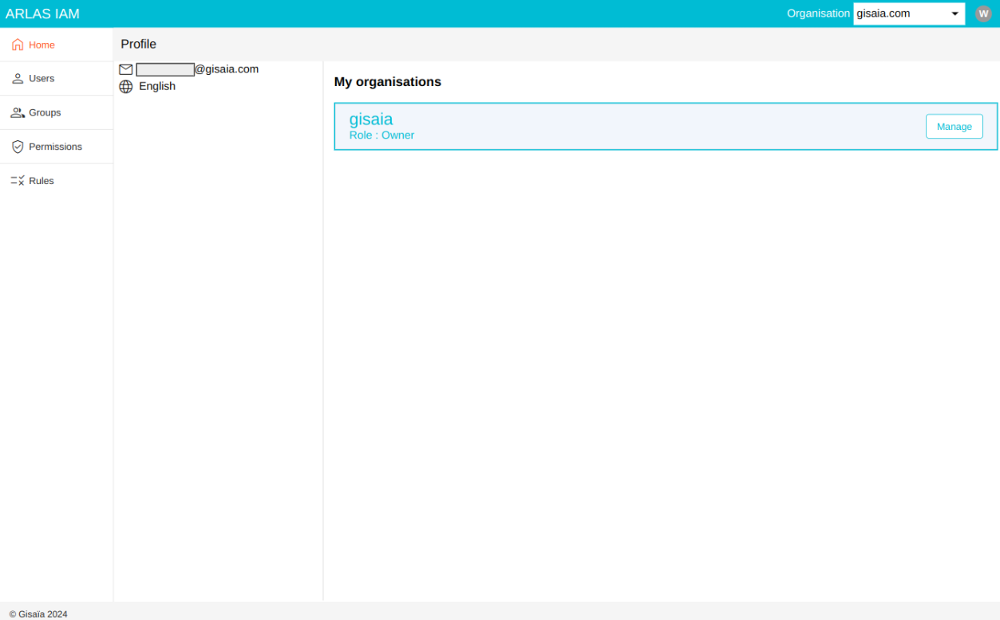

# Concepts

## ARLAS Dashboards

An ARLAS Dashboard is an interactive platform to explore datasets.

Example: ARLAS dashboard

## ARLAS Hub

The Hub is the interface where you visualize all the available dashboards and their data collection. 

You can explore and manage the dashboards.

Example: ARLAS Hub to manage dashboards

## ARLAS Builder

ARLAS Builder is the studio to edit ARLAS Dashboards. 
It is a no code interactive interface to configure the geographic layers, the widgets and all elements of the dashboard. 

Example: ARLAS Builder to configure widgets 

## ARLAS IAM

ARLAS IAM can handle the authentication of ARLAS users. It has it's own no-code interface to manage who can access the ARLAS resources.

Example: ARLAS IAM to manage users 

## arlas_cli

__ARLAS Command Line__ (`arlas_cli`) is a tool to manage data and configurations in ARLAS.

See [arlas_cli documentation](https://gisaia.github.io/arlas_cli/).

## Elasticsearch

[Elasticsearch](https://www.elastic.co/fr/elasticsearch) is a distributed, open-source search and analytics engine built on Apache Lucene. 
It allows users to store, search, and analyze large volumes of structured and unstructured data in near real-time. 

ARLAS rely on Elasticsearch, an open-source search engine to perform quick aggregation requests over data.

## ES index

An [Elasticsearch index](https://www.elastic.co/blog/what-is-an-elasticsearch-index/) is a logical container that stores and organizes documents, which are the fundamental data units in Elasticsearch. 
Each index is made up of one or more shards and can be thought of as similar to a database table, containing related data with a defined structure. 
It allows efficient storage, search, and retrieval of data by applying indexing and mapping techniques tailored to specific use cases.

## ES mapping

An [Elasticsearch mapping](https://www.elastic.co/guide/en/elasticsearch/reference/current/mapping.html) defines how documents and their fields are stored and indexed in an Elasticsearch index.
It specifies the data types (e.g., text, keyword, integer, date) and configurations for each field, influencing how data can be searched, analyzed, and retrieved.
Mappings also allow customization of field behaviors, such as enabling full-text search, controlling case sensitivity, or defining nested structures.
Proper mapping design is crucial for optimizing query performance and ensuring accurate search results.

## ARLAS collection

An [ARLAS collection](https://docs.arlas.io/arlas-api-collection/) is a structured data layer within the ARLAS platform, built on top of Elasticsearch indices, that organizes and exposes geospatial and temporal data for exploration, analysis, and visualization. 
It serves as a virtual representation of an Elasticsearch index, allowing users to define metadata, filtering rules, and settings specific to their use cases. 
Collections enable ARLAS to efficiently handle large-scale, multidimensional data while providing APIs for querying, aggregating, and displaying the information in user-friendly formats.

