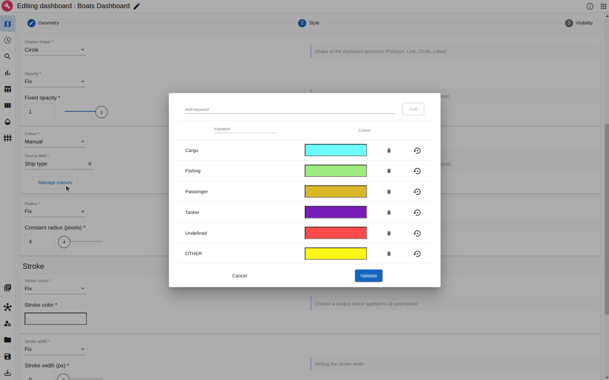
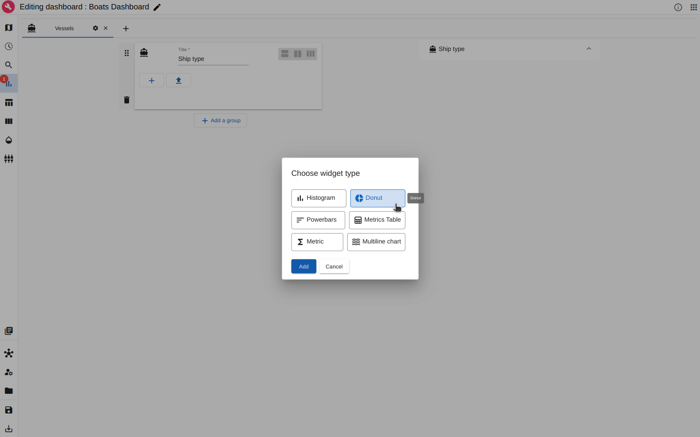
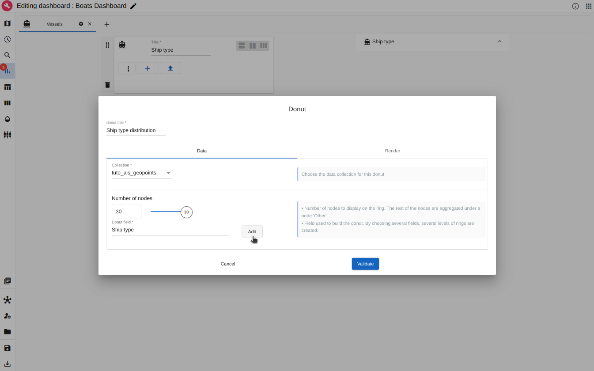

# Vessel location (AIS) Tutorial

## About this tutorial
### What will you learn ?
With this tutorial, you'll be able to:

- Index some AIS data in Elasticsearch
- Reference the indexed AIS data in ARLAS
- Create a view of ARLAS-wui (a dashboard) to explore the AIS data using ARLAS-wui-hub and ARLAS-wui-builder

### What will you need ?

Follow the [Get Started](../../get_started.md) guide to configure your environment.

### What will you get ?

An ARLAS dashboard with map layers and graphs to explore a sample of AIS data.


<p align="center" style="font-style: italic;" >
 Exploration app created in this tutorial
</p>

## The tutorial data

### AIS data

Let's explore some boats position data, provided by the __Danish Maritime Authority__ on their [website](https://www.dma.dk/safety-at-sea/navigational-information/ais-data){:target="_blank"}.

This tutorial is based on AIS data emitted from 11/20/2019 to 11/27/2019. We extracted boats positions having the following MMSI :

 - 257653000
 - 265177000
 - 220051000
 - 240305000
 
We built a subset named `ais_data_sample.csv`. It contains around 162192 boats positions described with 26 columns.

Example of some columns:

- Timestamp: Moment when the position is emitted
- MMSI: Identifier of the boats emitter
- Name: Name of the boat
- Ship type: Type of the boat

A line of the csv file looks like:

|Timestamp|Type of mobile|MMSI|Latitude|Longitude|Navigational status|ROT|SOG|COG|Heading|IMO|Callsign|Name|Ship type|Cargo type|Width|Length|Type of position fixing device|Draught|Destination|ETA|Data source type|A|B|C|D|  
|---|---|---|---|---|---|---|---|---|---|---|---|---|---|---|---|---|---|---|---|---|---|---|---|---|---|
|20/11/2019 06:45:09|Class A|240305000|55.931783|17.345067|Under way using engine|0.0|10.5|257.0|259|9288710|SYEF|DELTA CAPTAIN|Tanker|""|44|249|GPS|10.0|FOR ORDERS|22/11/2019 06:00:00|AIS|216|33|22|22|

### __Prepare AIS data__

We will explore this data using ARLAS.

- Check that `ais_data_sample.csv` file is downloaded

```shell
ls -l ./tutorials/ais/data/ais_data_sample.csv
```

Apply basic transformations with a python scripts before ingesting the data. Run in a terminal at the project root:

```shell
python3.10 ./tutorials/ais/prepare_ais_data.py
```

Here the script creates a point geometry in WKT format as well as a unique identifier and then write the data in an NDJson file (`ais/data/ais_data_sample.json`). 

!!! tip
    The script can be edited to enrich the data before exploring it.


## Ingest AIS data in ARLAS

### __Index AIS data in Elasticsearch__

- Create an empty `ais_geopoints` index in Elasticsearch with the mapping inferred by `arlas_cli`

```shell
arlas_cli indices \
    mapping tutorials/ais/data/ais_data_sample.json/part-00000-*.json \
    --no-fulltext unique_id \
    --field-mapping MMSI:keyword \
    --field-mapping Timestamp:date-"dd/MM/yyyy HH:mm:ss" \
    --push-on ais_geopoints
```


Check that the index has been created:

<!-- termynal -->
```shell
> arlas_cli indices list
+---------------+--------+-------+------+
| name          | status | count | size |
+---------------+--------+-------+------+
| .arlas        | open   | 0     | 247b |
| ais_geopoints | open   | 0     | 225b |
+---------------+--------+-------+------+
```

!!! success
    The index exists. It does not contain any data yet.
    

You can check that the data model is correct:

<!-- termynal -->
```shell
> arlas_cli indices describe ais_geopoints
+--------------------------------+-----------+
| field name                     | type      |
+--------------------------------+-----------+
| A                              | long      |
| B                              | long      |
...
| point_geom                     | geo_point |
| unique_id                      | keyword   |
+--------------------------------+-----------+
```

- Index data that is in `ais_data_sample.json` in Elasticsearch with `arlas_cli`
```shell
arlas_cli indices data ais_geopoints tutorials/ais/data/ais_data_sample.json/*.json
```

Check the state of the data index:
<!-- termynal -->
```shell
> arlas_cli indices list
+---------------+--------+--------+--------+
| name          | status | count  | size   |
+---------------+--------+--------+--------+
| .arlas        | open   | 4      | 12.1kb |
| ais_geopoints | open   | 162192 | 33.2mb |
+---------------+--------+--------+--------+
```
!!! Success
    
    The __162192__ AIS positions are available in the `ais_geopoints`


### __Declare ARLAS collection__

ARLAS-server interfaces with the data indexed in Elasticsearch via a collection reference.

The collection references an identifier, a timestamp, and geographical fields which allows ARLAS-server to perform a spatial-temporal data analysis.

See [ARLAS Collection](../../../../static_docs/concepts.md#arlas-collection) for more details.

- Create the `tuto_ais_geopoint` collection in ARLAS

```shell
arlas_cli collections \
    create tuto_ais_geopoints \
    --index ais_geopoints \
    --display-name "AIS Geopoints" \
    --id-path unique_id \
    --centroid-path point_geom \
    --geometry-path point_geom \
    --date-path Timestamp
```

- Check that the collection is created:

<!-- termynal -->
```shell
> arlas_cli collections list
+--------------------+---------------+
| name               | index         |
+--------------------+---------------+
| tuto_ais_geopoints | ais_geopoints |
+--------------------+---------------+
```
!!! success

    The `tuto_ais_geopoints` is created and targets the `ais_geopoints` index.

<br />
<br />

## __Create a dashboard to explore `AIS data` with ARLAS__

The ARLAS stack is up and running, and AIS position data is available for exploration.

We can now create our first dashboard composed of:

- A map to observe the boats positions' geographical distribution
- A timeline presenting the number of boats positions over time
- A search bar to look for boats by their names for instance
- Some widgets to analyse the data from another axis such as the speed distribution.

### Create a dashboard 

To do so, let's go to [ARLAS-wui-hub](http://localhost/hub/){:target="_blank"} and create a new dashboard named `Boats dashboard`


<p align="center" style="font-style: italic;" >
Image: Creation of a dashboard in ARLAS-wui-hub
</p>

After clicking on __Create__, you are automatically redirected to ARLAS-wui-builder to start configuring your dashboard.

The first thing we need to do is to tell ARLAS which collection of data we want to use to create our dashboard.


<p align="center" style="font-style: italic;" >
Image: Choose collection
</p>

We choose the `tuto_ais_geopoints` collection containing the ingested data.
<br />
<br />

### Map configuration

As a first step, let's set the map at **zoom level 13** and the map's center coordinates at **Latitude=57.451545** and **Longitude=10.787131**.

This way, when loading the dashboard in ARLAS-wui, the map will be positioned over Denmark.


<p align="center" style="font-style: italic;" >
Image: Map initialisation
</p>
<br />

#### Visualisation set

In ARLAS, map layers can be organised in groups called **Visualisation Set**.

All the layers of a group are shown/hidden together.

We create a first Visualisation Set that we call `Vessels Location` and we display it by default:


<p align="center" style="font-style: italic;" >
Image: Create a visualisation set called Vessel Location
</p>
<br />

#### Location layer colored by ship type

Currently, the map is empty. 

Our first goal is to determine where the boats are located and identify their ship types.


<p align="center" style="font-style: italic;" >
Image: Layer view
</p>
<br />

To do so, let's add a layer named `Ship type` to visualise the boats location colored by their type.

In the Geometry section, choose the `point_geom` features geo-field.


<p align="center" style="font-style: italic;" >
Image: Adding a Geometric features layer named 'Ship type'
</p>

!!! note
    The layer is included in the visualisation set `Vessels Location`.

<br />

Now, let's define the layer's style. 

As a starter, we choose the best representation of our geometries: Boats positions are points, we represent it as **Circle**. 

We choose to color the points according to the `Ship type` field values contained in the data.

We set the radius to a fixed 4 pixels.


<p align="center" style="font-style: italic;" >
Image: Customising the 'Ship type' layer style
</p>
<br />

Let's switch to the visibility tab.

We notice that by default, the layer is displayed for all zoom levels (range **[0-23]**) and for a maximum number of elements of **5000**.

If more geopoints are located in your map extend, the layer will no longer be displayed. 
This limit is often used to switch between direct geometric features layers and aggregated layers (see [Aggregated layer](#geo-big-data-aggregated-layer) below). 

Let's increase the limit number of elements to **10000**.


<p align="center" style="font-style: italic;" >
Image: Customising the 'Ship type' layer visibility
</p>
<br />

!!! success
    After clicking on `Validate`, our first layer is created


<p align="center" style="font-style: italic;" >
Image:  New layer 'Ship type' is created
</p>

!!! note
    We can edit each layer with the Actions button.

<br />

We can now preview the layer in Preview tab


<p align="center" style="font-style: italic;" >
Image: Preview of the 'Ship type' layer
</p>
<br />

We see now where the boats are passing by thanks to this layer.
<br />
<br />

#### Geo Big Data: Aggregated Layer

For this tutorial, we have ~160 000 boats positions to explore, but ARLAS can handle millions of positions.

It would be very difficult to display them all as it would be very heavy to request all that data at once and the browser will not be able to render as many features. 
We will end up loosing the user experience fluidity.

Most importantly, loading millions of boats positions on the map will not be necessarily understandable: we cannot derive clear and synthesized information from it.

That's why ARLAS proposes a geo-analytic view: we can aggregate the boats positions to a geographical grid and obtain a geographical distribution!

Let's create a dedicated **Cluster** layer for boats positions geographical distribution. We call this layer `Distribution`.


<p align="center" style="font-style: italic;" >
Image: Creating a geographical distribution layer called 'Distribution'
</p>
<br />

We choose the **Cluster** type, we aggregate the `point_geom` geo-field to a geographical **Tile Grid** and we choose a **fine** granularity for this grid.

We will display on the map the grid's cells.

Let's define the style of these cells in `Style` section:


<p align="center" style="font-style: italic;" >
Image: Creating a geographical distribution layer
</p>
<br />

We **interpolate** the cells **colors** to the number of boats positions in each cell. 
That's why we choose **Hits count** that we normalise and choose a color palette.

In the visibility tab, we can also set the **Minimum Features** number to 10000 to switch correctly with the created [location layer](#location-layer-colored-by-ship-type).

After saving this layer, we can again visualise it and explore where the positions are geographically in the `Preview` tab.


<p align="center" style="font-style: italic;" >
Image: Boats positions geographical distribution
</p>

<br />

In the preview tab, you can save your current visualisation as **Preview** that will be displayed to represent the dashboard in the hub.

Save your modifications and switch to ARLAS Hub:


<p align="center" style="font-style: italic;" >
Image: Dashboard preview in ARLAS Hub
</p>


### Timeline configuration

Let's find out the time period when these positions were emitted.

For that, let's define a timeline: a histogram that will represent the number of boats positions over time.

For the x-Axis we choose the timestamp field and for the y-Axis we choose Hits count: the number of positions in each bucket. We set 50 buckets in this example


<p align="center" style="font-style: italic;" >
Image: Define timeline
</p>
<br />

In the Render tab we can set a title for the timeline, date format and the histogram type.


<p align="center" style="font-style: italic;" >
Image: Rendering of timeline
</p>
<br />

### Search Bar configuration

To define the search bar we can set :

 - the placeholder string
 - the field used to search keywords
 - the field used to autocomplete the searched words


<p align="center" style="font-style: italic;" >
Image: Define search bar
</p>
<br />

### Analytics board

We focused on the geographical and temporal analysis. We can also explore other dimensions of the data.

#### Create a tab

ARLAS proposes to organise all the analytic graphs (widgets) in tabs. A tab can correspond to a thematic analysis.

Let's create a tab called 'Vessels' where we will add our widgets.


<p align="center" style="font-style: italic;" >
Image: Creating tab in Analytics board
</p>
<br />

!!! note
    We can configure the tab "icon" that will represent the tab in the dashboard.

Once the tab is created, we can add groups and widgets.

#### Distribution of Vessel type (term)

We want to observe the distribution of the geopoints per ship type.

The first step is to create a group that we call 'Ship type' (we can configure its icon) and create a widget.


<p align="center" style="font-style: italic;" >
Image: Creating a 'Ship Type' group and add a widget
</p>
<br />

The **Donut** widget and the **Powerbars** are well adapted to explore a term field distribution.

##### Create a Donut

Let's create a **Donut** widget


<p align="center" style="font-style: italic;" >
Image: Creating a Donut widget to explore 'Ship Type' distribution
</p>

The donut is base on the `Ship type` data field.

<br />

##### Create a Powerbars

Let's create a **Powerbars** widget to complement the Ship type exploration:


<p align="center" style="font-style: italic;" >
Image: Add a Powerbar widget to explore 'Ship Type' distribution
</p>
<br />

We create a **Powerbars** where each value of the aggregation field (`Ship type`) is represented by a bar corresponding to its number of datapoints.


<p align="center" style="font-style: italic;" >
Image: Configure the Powerbar widget to explore 'Ship Type' distribution
</p>

!!! tip
    In the `Render` tab, you can color the powerbars 

<br />

The two widgets to explore the `Ship type` information are now available:


<p align="center" style="font-style: italic;" >
Image: Configure the Powerbar widget to explore 'Ship Type' distribution
</p>

We can add as many tabs, groups and widgets as we want to explore our data.

<br />

#### Distribution of Heading (number)

Let's see what does the heading distribution of these vessels looks like.

We add a new group we call 'Heading' and create a histogram.


<p align="center" style="font-style: italic;" >
Image: Creating a group in Analytics board tab
</p>
<br />

Let's configure our histogram. We can give a title to the Heading distribution histogram.

For the x-Axis we choose `Heading` field and for the y-Axis we choose `Hits count`: the number of positions in each bucket. 


<p align="center" style="font-style: italic;" >
Image: Defining heading distribution histogram
</p>
<br />

When we save the histogram we automatically get a preview of it in the analytics board.


<p align="center" style="font-style: italic;" >
Image: Preview heading distribution histogram
</p>

!!! tip 
    Feel free to add all the widgets you want to explore the data ! 
<br />

## Explore the dashboard in ARLAS-Wui

Now we defined :

 - The map layers
 - The timeline 
 - The search bar
 - The widgets

Let's save this dashboard by clicking on the 'Disk' icon at the bottom-left of the page.

If we go back to [ARLAS Hub](http://localhost/hub/){:target="_blank"}, we'll find the Boats dashboard created.


<p align="center" style="font-style: italic;" >
Image: List of created dashboards
</p>
<br />

We can now open it in ARLAS-Wui to explore AIS locations:


<p align="center" style="font-style: italic;" >
Image: Exploring Boats dashboard in ARLAS-wui
</p>
<br />
<br />
 
As you can see we created a simple dashboard to start exploring raw AIS data!

Check out a more sophisticated dashboards about the AIS data in our [demo space](https://cloud.arlas.io/arlas/wui/hub/){:target="_blank"}!

You can get inspired from our different demos to build other map layers and other widgets.