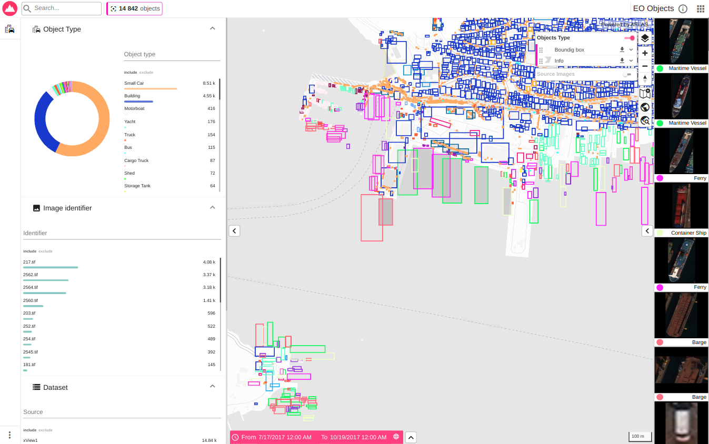
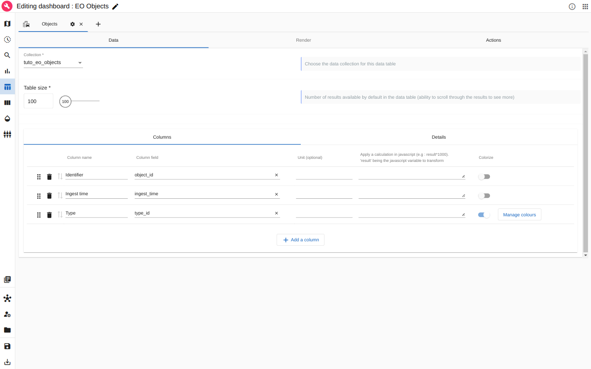

# Earth Observation Objects Tutorial

## About this tutorial

### What will you learn ?

With this tutorial, you'll be able to:

- Obtain a sample of objects detected in Earth Observation (EO) images.
- Index the data for these objects in Elasticsearch.
- Reference the indexed object data within ARLAS.
- Create an ARLAS dashboard using a configuration file.
- Configure the dashboard to visualize the images associated with the detected objects

### What will you need ?

Follow the [Get Started](../../get_started.md) guide to configure your environment.

### What will you get ?

An ARLAS dashboard with map layers and widgets to explore a sample of the EO Objects data.



<p align="center" style="font-style: italic;" >
 Exploration app created in this tutorial
</p>

## The tutorial data

### xView Dataset

The Earth Observation objects are a sample of the [xView dataset](https://xviewdataset.org/). 
xView is one of the largest publicly available datasets of overhead imagery. 
It contains images from complex scenes around the world, annotated using bounding boxes.

<figure markdown="span">
  
  <figcaption>Example of xView dataset</figcaption>
</figure>

This dataset is widely used to train and evaluate machine learning algorithms for object detection in Earth Observation (EO) images.

We processed this data to create a NDJSON file where each row is a detected object and its metadata:

|    bounds_imcoords|         center_geom|dataset_source|         edited_by|feature_id|            geometry|          image_geom|image_id|image_number|         ingest_time|         object_id|original_index| timestamp|       type_id|
|-------------------|--------------------|--------------|------------------|----------|--------------------|--------------------|--------|------------|--------------------|------------------|--------------|----------|--------------|
|  859,1521,940,1617|POINT (23.56328 3...|        xView1|    wwsofiaramirez|    435590|POLYGON ((23.5631...|POLYGON ((23.5724...|2547.tif|        2547|2017-07-27 12:46:...|2547.tif_obj.45535|         45535|1501159561|         Barge|
|4045,1786,4079,1810|POINT (23.572215 ...|        xView1|      wwedithcolon|    352703|POLYGON ((23.5721...|POLYGON ((23.5724...|2547.tif|        2547|2017-07-21 19:36:...|2547.tif_obj.45536|         45536|1500665778|      Building|


The original images are geolocated TIFF files. We extracted the objects' images based on their bounding boxes (BBOX) and stored them as JPG files.

All these images are stored in a public bucket to make them accessible in ARLAS. In this tutorial, we will use these images to display the objects alongside their source Earth Observation (EO) images.

For this tutorial, we extracted a sample of 14,842 objects from 22 EO images covering parts of Athens, Greece.

### Download the data

To download the EO objects data, run at project root:
```
python tutorials/eo_objects/download_eo_objects_data.py
```

!!! success
    The downloaded NDJSON file is stored at: `tutorials/eo_objects/data/eo_objects/xView/eo_objects_athens.json`


## Ingest data in ARLAS

!!! warning 
    If `arlas_cli` is configured for local ARLAS, the `--config local` option in all tutorial `arlas_cli` commands must be specified.

    Example:
    ```shell hl_lines="2"
    arlas_cli indices \
        --config local \
        mapping ...
    ```

### __Index AIS data in Elasticsearch__

- Create an empty eo_objects index in Elasticsearch with the mapping inferred by `arlas_cli`

```
arlas_cli indices \
    mapping tutorials/eo_objects/data/eo_objects/xView/eo_objects_athens.json/part-00000-*.json   \
    --no-fulltext original_index \
    --no-fulltext bounds_imcoords \
    --no-fulltext feature_id \
    --no-fulltext dataset_source \
    --no-fulltext object_id \
    --no-fulltext image_number \
    --no-fulltext ingest_time \
    --nb-lines 100 \
    --push-on eo_objects
```

Check that the index has been created:

<!-- termynal -->
```shell
> arlas_cli indices list
+------------+--------+-------+------+
| name       | status | count | size |
+------------+--------+-------+------+
| eo_objects | open   | 0     | 225b |
+------------+--------+-------+------+
```

!!! success
    The `eo_objects` index exists. It does not contain any data yet.

You can check that the data model is correct:

<!-- termynal -->
```shell
> arlas_cli indices describe eo_objects
+-----------------------+-----------+
| field name            | type      |
+-----------------------+-----------+
| center_geom           | geo_point |
| geometry              | geo_shape |
| image_geom            | geo_shape |
| image_id              | keyword   |
...
| object_id             | keyword   |
| timestamp             | date      |
| type_id               | keyword   |
+-----------------------+-----------+
```

- Index the `eo_objects.json` data in Elasticsearch with `arlas_cli`
```
arlas_cli indices \
    data eo_objects \
    tutorials/eo_objects/data/eo_objects/xView/eo_objects_athens.json/*.json
```

Check the state of the index:
<!-- termynal -->
```shell
> arlas_cli indices list
+------------+--------+-------+------+
| name       | status | count | size |
+------------+--------+-------+------+
| eo_objects | open   | 14842 | 6mb  |
+------------+--------+-------+------+
```

!!! Success
    
    The __14842__ EO objects are available in the `eo_objects`


### Delete index

If you want to delete the index, run:
```
arlas_cli indices delete eo_objects 
```

!!! warning
    Before reindexing data, don't forget to [recreate an empty index with mapping](#__index-ais-data-in-elasticsearch__)

### Create collection

ARLAS-server interfaces with the data indexed in Elasticsearch via a collection reference.

The collection references an identifier, a timestamp, and geographical fields which allows ARLAS-server to perform a spatial-temporal data analysis, as well as general information about the collection's ownership, visibility and display names.

See [ARLAS Collection](../../concepts.md#arlas-collection) for more details.

- Create the `tuto_eo_objects` collection in ARLAS
```
arlas_cli collections \
    create tuto_eo_objects \
    --index eo_objects \
    --display-name "EO Objects" \
    --centroid-path center_geom \
    --geometry-path geometry \
    --date-path timestamp \
    --id-path object_id \
    --owner tutorial
```

- Check that the collection is created:

<!-- termynal -->
```shell
> arlas_cli collections list
+-----------------+------------+
| name            | index      |
+-----------------+------------+
| tuto_eo_objects | eo_objects |
+-----------------+------------+
```
!!! success

    The `tuto_eo_objects` collection is created and targets the `eo_objects` index.

<br />
<br />

## Create a dashboard

!!! note
    The dashboard `EO Objects` is available on [cloud.arlas.io](https://cloud.arlas.io/arlas/wui/hub/) to explore the full dataset

### Create an ARLAS dashboard from a configuration file

Depending on your deployment, change the ARLAS server URL in the dashboard configuration. 

Run at the project root:

=== "Local"
    ```
    export ARLAS_SERVER_URL=http://localhost/arlas

    envsubst '$ARLAS_SERVER_URL' < tutorials/eo_objects/arlas/template.config.dashboard.json > tutorials/eo_objects/arlas/config.dashboard.json
    ```
    
    Then create the ARLAS dashboard from the configuration file: 
    ```
    arlas_cli persist \
        --config local \
        add tutorials/eo_objects/arlas/config.dashboard.json config.json --name "EO Objects"
    ```
   
=== "ARLAS Cloud"

    ```
    export ARLAS_SERVER_URL=https://cloud.arlas.io/arlas/server

    envsubst '$ARLAS_SERVER_URL' < tutorials/eo_objects/data/arlas/template.config.dashboard.json > tutorials/eo_objects/data/arlas/config.dashboard.json
    ```
    
    Then create the ARLAS dashboard from the configuration file: 
    ```
    arlas_cli persist \
        add tutorials/eo_objects/data/arlas/config.dashboard.json config.json --name "EO Objects"
    ```


<p align="center" style="font-style: italic;" >
 ARLAS with the created "EO Objects" dashboard
</p>

!!! success

    The `EO Objects` Dashboard is accessible in ARLAS.


You can set a preview by editing the dashboard and choosing a view in the map `Preview` tab:


<p align="center" style="font-style: italic;" >
Set EO Objects dashboard preview
</p>

The created dashboard has now its preview in ARLAS Hub:


<p align="center" style="font-style: italic;" >
ARLAS with the created "EO Objects" dashboard and its preview
</p>

<br />
<br />

### Data table

The **Data Table** allows you to display data values as a table on the right side of the application. 
Each row corresponds to an indexed element, such as an EO object detected in an image.

There are strong interactions between the data table and the visible map layers. 
For instance, the displayed elements in the table correspond to objects currently visible on the map. 
It is also possible to configure layers that only contain the table's data.

#### Creating a data table

To explore an item's information and details, you can create a table.

Let’s create a Data Table called **Objects** and choose the data fields to display.

##### Configure the main table

In the `Data` tab, select the main fields that identify the objects:

- `object_id`: The object identifier
- `ingest_time`: The time the object was ingested
- `type_id`: The detected type of the object



<p align="center" style="font-style: italic;" >
Set the objects Data Table main information
</p>

You can also color the **Type** column for better visualization.

Now, the Data Table can be opened on the right side of the dashboard.


<p align="center" style="font-style: italic;" >
Visualize Data Table in the ARLAS Dashboard
</p>

!!! note
    Hovering an element in the data table highlights its geometry on the map (here, the pink bbox).

    This interactive feature links the information in the table with the element's location on the map.

##### Configure the table details

While the main data fields are set in the Data Table, you can add more fields in the table's `Details` section.

We can organize the data fields into sections. For example, we can add information related to the object itself and its source image.


<p align="center" style="font-style: italic;" >
Set the objects Data Table details
</p>


In the ARLAS Dashboard, these details can be expanded or collapsed as needed.


<p align="center" style="font-style: italic;" >
Visualize the objects Data Table details
</p>

!!! tip

    Use the `Zoom to` button to zoom in on an object's location.


#### Configuration of the image grid

The objects can include metadata and associated images, which can also be displayed in ARLAS Dashboards.

The data table can be configured to access images stored on a server. 
For instance, we stored some EO objects images as `.jpg` in a public [object store](https://console.cloud.google.com/storage/browser/gisaia-public/demo/eo_objects/xView;tab=objects?pageState=(%22StorageObjectListTable%22:(%22f%22:%22%255B%255D%22))&project=arlas-184007&pli=1&prefix=&forceOnObjectsSortingFiltering=false):

These images can be accessible in ARLAS dashboards using the following url:

`https://storage.googleapis.com/gisaia-public/demo/eo_objects/xView`

##### Object thumbnails

Let's first configure the object thumbnails. It is a simple light preview of the object that is stored in *xView/objects_thumbnails/jpg*.

It contains the images named using the object identifier: **{object_id}.jpg**

Example: 
```
2560.tif_obj.46851.jpg
2560.tif_obj.46852.jpg
2560.tif_obj.46853.jpg
```

Let's define the url pattern that will access the associated image for each object based on its `object_id` value:

`https://storage.googleapis.com/gisaia-public/demo/eo_objects/xView/objects_thumbnail/jpg/{object_id}.jpg`

In the Data Table `Render` tab, we define this url as the Thumbnail url.

!!! note

    We can add a **Color** field and a **Title** field that will be used to display the image.

    Let's choose the `type_id` field corresponding to the object's detected type.


<p align="center" style="font-style: italic;" >
Visualize the objects thumbnails
</p>

!!! success
    Now, object images are visible in the dashboard on the right side.

You can expand the full grid of thumbnails:  


<p align="center" style="font-style: italic;" >
Visualize the objects thumbnails full grid
</p>

You can scroll within the grid to see more object images.

##### EO image Quicklook

Thumbnails are usually small, lightweight images. For higher quality, larger images, we configure **Quicklooks**.

We can define multiple Quick Looks for each object. For example, let's define two Quicklooks:

- The cropped object: `https://storage.googleapis.com/gisaia-public/demo/eo_objects/xView/objects_thumbnail/jpg/{object_id}.jpg`
- Its source image: `https://storage.googleapis.com/gisaia-public/demo/eo_objects/xView/train_images_jpg/{image_number}.jpg`

!!! note

    In this example, the same URL is used for both thumbnails and cropped objects, but higher-resolution images could also be used.

    The cropped object uses the `object_id` field in its URL, while the source image uses the `image_number` field.


<p align="center" style="font-style: italic;" >
Configure the Objects and Source image Quicklooks
</p>

You can then visualize both images for each object by clicking on its thumbnail.


<p align="center" style="font-style: italic;" >
Visualise Object Quicklooks
</p>

You can switch between Quicklooks.


<p align="center" style="font-style: italic;" >
Visualise Source Image Quicklooks
</p>

You can also open the Quicklook in full screen:


<p align="center" style="font-style: italic;" >
Visualise Source Image Quicklooks
</p>

<br />
<br />


## Explore the dashboard in ARLAS-Wui

After saving your ARLAS Dashboard, you can explore all the tutorial detected objects:


<p align="center" style="font-style: italic;" >
Explore EO Objects in ARLAS Dashboard
</p>

This simple dashboard allows you to start exploring EO object data!

Check out a more EO objects data and other datasets in our [demo space](https://cloud.arlas.io/arlas/wui/hub/)!