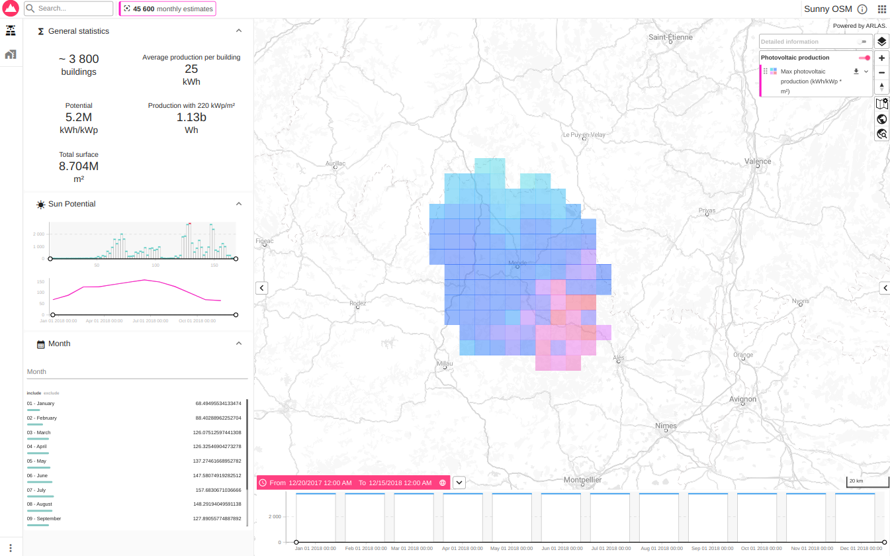
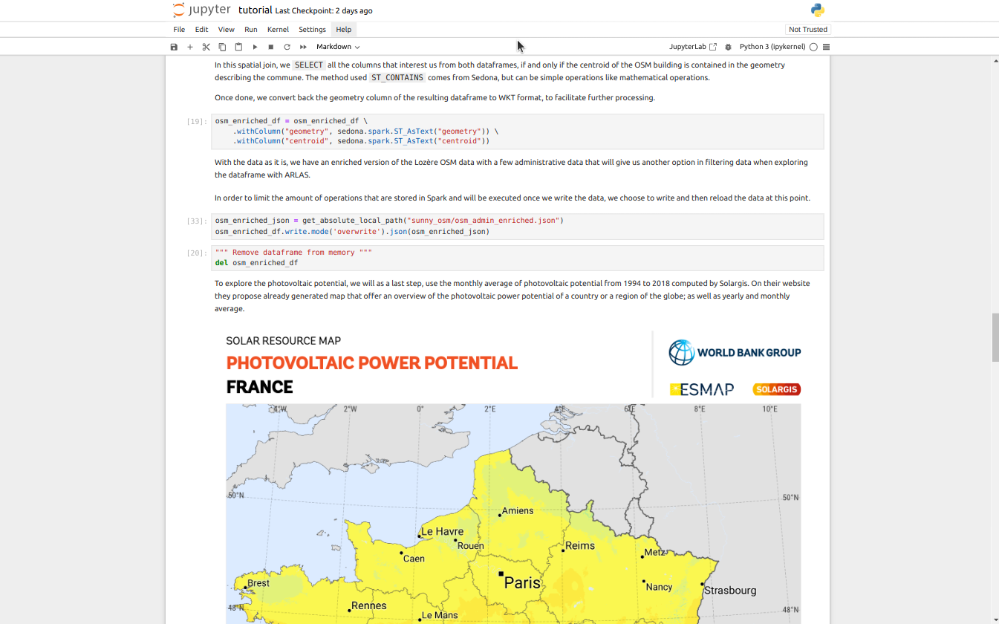
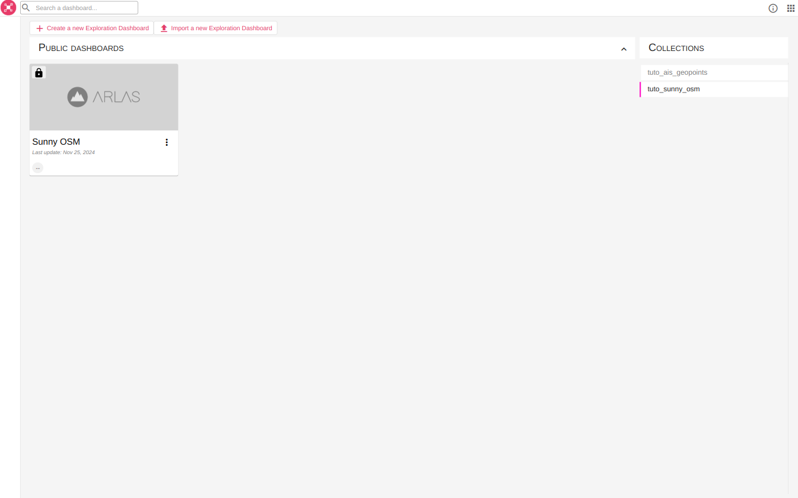
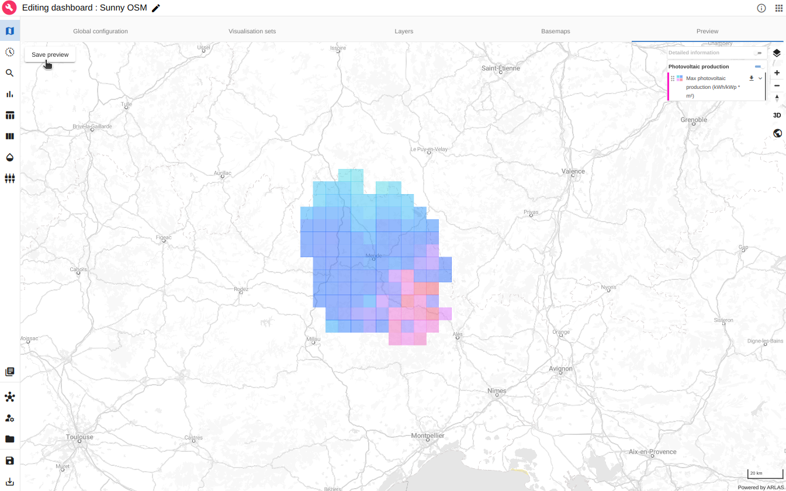
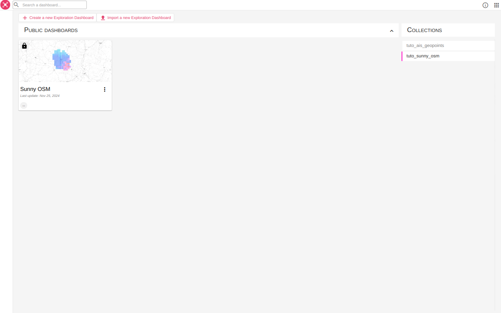

# OSM and photovoltaic data

## About this tutorial

### What will you learn ?
With this tutorial, you'll be able to:

- Process multiple data sources (vector and raster data) in a jupyter notebook
- Index the processed buildings solar potential data in Elasticsearch
- Reference the indexed solar data in ARLAS
- Create a view of ARLAS-wui (a dashboard) from a configuration file

### What will you need ?

Follow the [Get Started](../../get_started.md) guide to configure your environment.

There also are additional requirements:

- Java
- gsutil
- Jupyter

On Linux, they can be installed by doing

```shell
apt install default-jdk gsutil
pip install jupyter
```

### What will you get ?

An ARLAS dashboard with map layers and graphs to explore the photovoltaic potential of buildings of the Lozère french department.



<p align="center" style="font-style: italic;" >
 Exploration app created in this tutorial
</p>

## The tutorial data

This tutorial use three different open data sources to explore the buildings solar potential.

### OSM

[OpenStreetMap](https://en.wikipedia.org/wiki/OpenStreetMap) (abbreviated OSM) is a website that uses an open geographic database which is updated and maintained by a community of volunteers via open collaboration. Contributors collect data from surveys, trace from aerial photo imagery or satellite imagery, and also import from other freely licensed geodata sources. OpenStreetMap is freely licensed under the Open Database License and as a result commonly used to make electronic maps, inform turn-by-turn navigation, assist in humanitarian aid and data visualisation. OpenStreetMap uses its own topology to store geographical features which can then be exported into other GIS file formats. The OpenStreetMap website itself is an online map, geodata search engine and editor.

OSM data is a very valuable tool when it comes to datascience as it can bring freely licensed building data quite reliably all across the globe. In order to limit the volume of the downloaded data, websites like [Geofabrik's](https://www.geofabrik.de/data/download.html) are particularly helpful to easily select a chunk of the data, here Languedoc-Roussillon.

### ADMIN Express

[The National Institute of Geographic and Forest Information (IGN)](https://www.ign.fr/institut/identity-card) is a public administrative establishment placed under the joint authority of the Ministries in charge of ecology and forestry. Their goal is to guarantee the availability of geolocalised data and in particular sovereign data for the State, foster the appropriation and use of geographic data as well as maintain a high level of competence in the field of geographic information.

They produce a wide variety of interesting datasets when working with French geospatial data, as they give us information to enrich our own data with, for a better exploration. In this example, we will use their [ADMIN Express](https://geoservices.ign.fr/adminexpress) dataset to add the town info to each OSM building.

### Photovoltaic potential

[Solargis](https://solargis.com) is a Slovakian company that provides online access to high-resolution solar data and services around the domain of solar energy. They provide regional and [by country](https://solargis.com/resources/free-maps-and-gis-data?locality=france) solar resource maps that can be used as is or, in our case, to enrich data.

### Get the data

All the necessary data is stored in the Gisaïa bucket, and can be downloaded with:
```shell
export ARLAS_DEMO_REMOTE_DATA_PATH="gs://gisaia-public/demo"
export ARLAS_DEMO_LOCAL_DATA_PATH="tutorials/sunny_osm/data"
python3 tutorials/sunny_osm/download_raw_data.py
```

The OSM and IGN data are a section of the original data, with only the buildings with a type and the towns of Occitanie kept to limit the size of the downloads.

The path `ARLAS_DEMO_LOCAL_DATA_PATH` can be changed to any path of your liking.

If the script does not work, the files can directly be retrieved on [Google Cloud](https://console.cloud.google.com/storage/browser/gisaia-public/demo/sunny_osm).

### Transform the data

To transform the data and cross the data sources, a notebook (`tutorials/sunny_osm/tutorial.ipynb`) is available.

To run the notebook, you can run jupyter at the project root and open it:

```shell
jupyter notebook
```

Open the notebook and follow the guidance



<p align="center" style="font-style: italic;" >
 Example of notebook cells
</p>

It creates a NDJSON file ready to be ingested in ARLAS at `tutorials/sunny_osm/data/osm_sunny.json`

## Ingest data in ARLAS

### Create empty index with correct mapping

Infer mapping directly from the data:

```
arlas_cli indices \
    --config local \
    mapping tutorials/sunny_osm/data/sunny_osm/osm_sunny.json/part-00000-*.json \
    --no-fulltext osm_id \
    --no-fulltext month \
    --no-fulltext unique_id \
    --no-fulltext name \
    --field-mapping time:date-epoch_second \
    --field-mapping area:integer \
    --nb-lines 1000 \
    --push-on sunny_osm

```
### Index data

To index the object data created in `sunny_osm/osm_sunny.json`, run:
```
arlas_cli indices \
    --config local  \
    data sunny_osm \
    tutorials/sunny_osm/data/sunny_osm/osm_sunny.json/*.json
```

### Delete index

If you want to delete the index, run:
```
arlas_cli indices \
    --config local-admin \
    delete sunny_osm
```

!!! warning
    Before reindexing data, don't forget to [recreate empty index with mapping](#create-empty-index-with-correct-mapping).

### Create collection

To create the ARLAS collection, run:
```
arlas_cli collections \
    --config local \
    create tuto_sunny_osm \
    --index sunny_osm \
    --display-name "Sunny OSM" \
    --centroid-path centroid \
    --geometry-path geometry \
    --date-path time \
    --id-path unique_id \
    --owner tmp
```

## Create an ARLAS dashboard from a configuration file

Depending on your deployment, change the ARLAS server URL in the dashboard configuration. 

Run at the project root:

=== "Local"
    ```
    export ARLAS_SERVER_URL=http://localhost/arlas

    envsubst '$ARLAS_SERVER_URL' < tutorials/sunny_osm/data/arlas/template.config.dashboard.json > tutorials/sunny_osm/data/arlas/config.dashboard.json
    ```
    
    Then create the ARLAS dashboard from 
    ```
    arlas_cli persist \
        --config local \
        add tutorials/sunny_osm/data/arlas/config.dashboard.json config.json --name "Sunny OSM"
    ```
   
=== "ARLAS Cloud"

    ```
    export ARLAS_SERVER_URL=https://cloud.arlas.io/arlas/server

    envsubst '$ARLAS_SERVER_URL' < tutorials/sunny_osm/data/arlas/template.config.dashboard.json > tutorials/sunny_osm/data/arlas/config.dashboard.json
    
    arlas_cli persist \
        add tutorials/sunny_osm/data/arlas/config.dashboard.json config.json --name "Sunny OSM"
    ```



<p align="center" style="font-style: italic;" >
 ARLAS with the created "Sunny OSM" dashboard
</p>

!!! success

    The `Sunny OSM` Dashboard is accessible in ARLAS.


You can set a preview by editing the dashboard and choosing a view in the map `Preview` tab:



<p align="center" style="font-style: italic;" >
Set Sunny OSM dashboard preview
</p>

The created dashboard has now it's preview in ARLAS Hub:



<p align="center" style="font-style: italic;" >
ARLAS with the created "Sunny OSM" dashboard and its preview
</p>